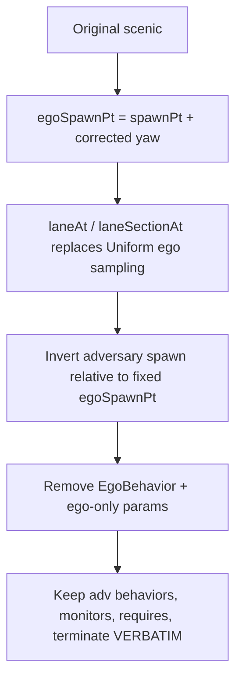

# Route-Driven Scenic Conversion Playbook

A practical, repeatable recipe for converting an **original adversarial Scenic
scenario** (where Scenic scripts *both* the ego and the adversary) into a
**route-driven scenario** (where SafeBench/an RL agent drives the ego along a
fixed route, and Scenic only scripts the adversary).

This complements [`ROUTE_DRIVEN_SCENIC_GUIDE.md`](ROUTE_DRIVEN_SCENIC_GUIDE.md)
(which covers route-pickle generation and running eval). **This document is
about the file-rewriting step itself** and the pitfalls learned doing it across
the `NHTSA_Crash`, `NHTSA_PreCrash`, `CARLA_Leaderboard`, and `UN_R171` benches.

> TL;DR of the hard-won lesson: **`globalParameters.yaw` is a CARLA yaw in
> degrees, not a Scenic heading in radians.** Using `facing yaw` silently
> produces a wrong orientation. It only bites when an adversary is anchored off
> `egoSpawnPt`'s heading. See [§4 The yaw/heading pitfall](#4-the-yawheading-pitfall-read-this).

---

## 1) Mental model

| | Original scenario | Route-driven scenario |
|---|---|---|
| Ego position | sampled (`Uniform(*network.lanes)`, `on lane.centerline`, or relative to adversary) | **fixed** by the route: `globalParameters.spawnPt` + `globalParameters.yaw` |
| Ego behavior | a Scenic `EgoBehavior` | **none** — SafeBench/RL agent steps the ego; any ego Scenic behavior is ignored |
| Adversary | placed relative to ego, with its own behavior | **unchanged in intent** — but re-anchored so it is placed relative to the now-fixed ego (spawn-chain inversion) |
| Termination, monitors, requires | as written | **copied verbatim** |

The whole job is: *pin the ego, invert the spawn chain so the adversary keeps
the same relative geometry, delete the ego behavior, and touch nothing else.*

---

## 2) Hard constraints (do not violate)

1. **Minimal diff.** Only change (a) the ego spawn source, (b) removal of the
   ego Scenic behavior + ego-only params, and (c) the adversary anchor when it
   was expressed relative to a previously-sampled ego.
2. **Preserve the adversary.** Keep adversary/pedestrian/prop `behavior` blocks,
   `monitor` blocks, `require` statements, `require monitor`, `regionContainedIn`,
   blueprints, and all distance/speed ranges.
3. **Never touch termination.** Copy every `terminate when` / `terminate after`
   line **byte-for-byte** from the original — even awkward forms like
   `distance to egoSpawnPt` (no `from ego`). Do not add, remove, reword, or
   "fix" them. (The verbatim audit in [§7](#7-validate) enforces this.)
4. **Spawn-chain inversion is geometry-preserving.** If the original said
   "ego is 20 m behind the adversary", the route-driven file must say
   "adversary is 20 m ahead of the ego" using the *same* distance.



---

## 3) Universal recipe (per file)

### 3.1 Fix the ego spawn (replace stochastic ego sampling)

```scenic
EgoSpawnPt = globalParameters.spawnPt
yaw = globalParameters.yaw
egoSpawnPt = new OrientedPoint at EgoSpawnPt, facing (-(yaw + 90) deg)   # see §4
```

Then derive lane context from the fixed point instead of sampling it:

| Original ego sampling | Route-driven replacement |
|---|---|
| `Uniform(*network.lanes)` / section scans | `egoInitLane = network.laneAt(egoSpawnPt.position)` |
| section-level work (adjacent lanes, projections) | `egoLaneSec = network.laneSectionAt(egoSpawnPt)` |
| `Uniform(*intersection.incomingLanes)` for ego | `egoInitLane = network.laneAt(egoSpawnPt.position)`, then filter `egoInitLane.maneuvers` |

### 3.2 Ego actor

```scenic
ego = new Car at egoSpawnPt,
    with rolename 'hero',
    with blueprint MODEL
```

- `new Car at <point>` takes its **heading from the road**, not from the point,
  so the ego always aligns to the lane regardless of the `facing` value. (This
  is *why* the yaw bug stays hidden until an adversary uses the point's heading.)
- Preserve the original ego `regionContainedIn` if it had one
  (e.g. `with regionContainedIn egoSection`).

### 3.3 Invert the adversary spawn (preserve relative geometry)

| Original pattern | Inverted (fixed ego) |
|---|---|
| `egoSpawnPt = behind advSpawnPt by D` | `advSpawnPt = following egoInitLane.orientation from egoSpawnPt for -D` (or `behind egoSpawnPt by D` **only after §4 fix**) |
| `advSpawnPt = ahead of egoSpawnPt by D` | keep, but **only after §4 fix**; or `following egoInitLane.orientation from egoSpawnPt for D` |
| `advSpawnPt in adjLane.centerline` + `project(egoSpawnPt)` | derive `adjLane`/`adjSection` from `laneSectionAt(egoSpawnPt)` (`_laneToLeft` / `_laneToRight`); keep the same `project` + offset chain |
| lead / prop chain ahead | keep the chain via the **road field**: `following roadDirection from egoSpawnPt for Range(...)` |
| intersection conflicting lane: `advSpawnPt in advInitLane.centerline` | keep the adv spawn line; derive `advManeuver` from `egoInitLane.maneuvers` / `conflictingManeuvers` |

**Prefer a VectorField over a scalar heading** for placement and for
`FollowLaneBehavior`/`FollowTrajectoryBehavior` adversaries:

- `following roadDirection from egoSpawnPt for D` — robust, never depends on yaw.
- `following egoInitLane.orientation from egoSpawnPt for D` — lane-accurate.
- `adjSection.centerline.project(egoSpawnPt.position)` — projects onto a neighbor lane.

These are independent of `egoSpawnPt`'s heading and therefore immune to the
yaw pitfall. Reach for `egoSpawnPt.heading` / `ahead of`/`behind egoSpawnPt`
only when you actually need the point's orientation — and then make sure §4 is
applied.

### 3.4 Always remove

- the `behavior EgoBehavior(...)` definition,
- `with behavior EgoBehavior(...)` on the ego,
- ego-only params (`EGO_SPEED`, `OPT_EGO_SPEED`, `OPT_SHARP_STEER`,
  `LOSS_CONTROL_STEER`, ego `egoTrajectory`, etc.).

If an **adversary** param referenced a removed ego param (e.g.
`EGO_SPEED + Range(5,10)`), substitute an equivalent standalone `Range` so the
adversary behavior is unchanged.

### 3.5 Never change

- every `terminate when` / `terminate after` line (verbatim),
- adversary/ped/prop `behavior` blocks,
- `monitor` blocks and `require monitor`,
- distance/speed `require` bands (only rename the lane variable when it now
  comes from the spawn point).

---

## 4) The yaw/heading pitfall (READ THIS)

**Symptom seen in the field:** `CARLA_Leaderboard/scenario_011` terminated
immediately, "before the ego even moved." The conversion looked correct and the
`terminate` lines were verbatim — yet the episode ended at t≈0.

**Root cause:** the route pickle stores `spawnPt['yaw']` as a **CARLA yaw in
degrees** (e.g. `-179.73`). Scenic's `facing` expects a **heading in radians**.
So `facing yaw` interpreted `-179.73` as radians and produced a garbage heading.

- The ego didn't care (`new Car at <point>` aligns to the road).
- But scenario_011 placed the adversary with `behind egoSpawnPt by Range(15,25)`
  and `with heading advSpawnPt.heading`, both of which read that **wrong**
  heading. The "emergency vehicle from behind" spawned ~52° off-axis and
  off-lane, drove erratically, and instantly tripped
  `terminate when (distance from advVehicle to egoSpawnPt) > 100`.

**The correct conversion** (from Scenic's own `carlaToScenicHeading`,
`scenic/simulators/carla/utils/utils.py`):

```text
scenic_heading_radians = normalizeAngle(-radians(carla_yaw_degrees + 90))
```

In a `.scenic` file, write it as:

```scenic
egoSpawnPt = new OrientedPoint at EgoSpawnPt, facing (-(yaw + 90) deg)
```

(`X deg` is Scenic's degrees→radians unit operator, so `-(yaw + 90) deg`
== `-radians(yaw + 90)`; `facing` normalizes the angle.)

**When does the bug actually bite?** Only when an adversary's *placement or
orientation* derives from `egoSpawnPt`'s heading. Grep before you ship:

```bash
rg -n 'egoSpawnPt\.heading|behind egoSpawnPt|ahead of egoSpawnPt|left of egoSpawnPt|right of egoSpawnPt|facing egoSpawnPt' \
   safebench/scenario/scenario_data/scenic_data_wenting/scenic_route-driven
```

Every hit must use the **corrected** `facing (-(yaw + 90) deg)` form (or be
rewritten to use a VectorField as in §3.3). Files that anchor adversaries only
via `roadDirection`, `lane.orientation`, or `.centerline.project(...)` are
unaffected and need no heading change.

> Quick sanity check that the heading is right: after sampling, the ego's
> heading and an "ahead/behind" adversary's heading should match the road
> direction and each other (relative heading ≈ 0° on a straight lane). See the
> harness in §6 — it prints exactly this.

---

## 5) Per-file workflow

For each `scenario_XXX.scenic`:

1. Read the original from `Self_Gemini_3flash_R1_original/{bench}/`.
2. Apply the universal recipe (§3) + the group-specific inversion (§8).
3. Apply the corrected heading (§4); grep for `egoSpawnPt.heading`-style usage.
4. **Copy the termination block last**, verbatim, and verify you didn't edit it.
5. Diff-check: only the ego-spawn block, ego-behavior removal, and the inverted
   adversary anchor should differ from the original.

---

## 6) Offline smoke test (no live CARLA needed)

`scenarioFromFile(...).generate()` compiles the file, loads the OpenDRIVE map,
and **samples a scene** (running all `require`s and placement math) without
connecting to a CARLA server. This catches: syntax errors, bad lane/maneuver
derivations, unsatisfiable requires, and — crucially — heading/placement bugs.

**Environment:** use the venv that has a matching Scenic + the CARLA 0.9.15
`cp310` egg. On this machine that is:

```bash
source /home/dellpro2/yungloon/chatscene310-venv/bin/activate
```

(Other envs failed: `chatscene` ships an incompatible Scenic API; `wenting311`
is py3.11 so the cp310 egg won't load and its `carla` lacks `TrafficLightState`.)

**Reusable harness** — replicates exactly how the runner injects route params
(`safebench/scenario/tools/scenario_utils.py` → `extra_params`):

```python
import json, os, pickle, math
from scenic import scenarioFromFile
from safebench.util.scenic_utils import merge_scenic_global_params

BASE = "safebench/scenario/scenario_data"
ROUTE_DIR = os.path.join(BASE, "route_wenting")
RD = os.path.join(BASE, "scenic_data_wenting", "scenic_route-driven")
data_full = pickle.load(open(os.path.join(ROUTE_DIR, "scenic_route.pickle"), "rb"))
index = json.load(open(os.path.join(ROUTE_DIR, "scenic_route_index.json")))

def check(bench, sid, rid=0):
    name = f"{bench}/scenario_{sid:03d}"
    try:
        data = data_full[index[f"{bench}:{sid}:{rid}"]["pickle_key"]]
        sp = data["spawnPt"]
        params = merge_scenic_global_params({
            "spawnPt": (sp["x"], sp["y"]), "z": sp["z"], "yaw": sp["yaw"],
            "town": data["town"], "weather": data["weather"],
            "waypoints": data["waypoints"], "lanePts": data["lanePts"],
        }, 0.1)
        scn = scenarioFromFile(os.path.join(RD, bench, f"scenario_{sid:03d}.scenic"),
                               params=params, model="scenic.simulators.carla.model", mode2D=True)
        scene, n = scn.generate(maxIterations=3000)
        ego = scene.objects[0]
        line = f"[OK] {name}: {len(scene.objects)} objs, {n} iters, ego_h={math.degrees(ego.heading):.1f}"
        if len(scene.objects) > 1:
            adv = scene.objects[1]
            rel = (math.degrees(adv.heading - ego.heading) + 180) % 360 - 180
            line += f", adv_h={math.degrees(adv.heading):.1f}, rel={rel:+.1f}"
        print(line)
    except Exception as e:
        print(f"[FAIL] {name}: {type(e).__name__}: {e}")

# edit this list, then run inside the venv from the repo root
for bench, sid in [("CARLA_Leaderboard", 11), ("UN_R171", 14), ("NHTSA_PreCrash", 15)]:
    check(bench, sid)
```

Save as a throwaway script at the repo root, run it, then delete it:

```bash
cd /home/dellpro2/yungloon/carla_utils-main/ChatScene-main
source /home/dellpro2/yungloon/chatscene310-venv/bin/activate
python _smoke.py && rm _smoke.py
```

**How to read it:**
- `[OK] ... 2 objs` → ego + adversary both placed; requires satisfiable.
- `rel` ≈ 0° on a straight lane for "ahead/behind" adversaries → heading correct.
- A large unexpected `rel`, or a `[FAIL]` with a `RejectionException` → revisit
  the inversion / heading.

For a full dynamic check (multi-step rollout, video), use
`scripts/run_eval_scenic.py` / `run_eval_scenic_batch.py` per
`ROUTE_DRIVEN_SCENIC_GUIDE.md` §4b with a CARLA server up.

---

## 7) Validate

### 7.1 Termination verbatim audit

Confirms no `terminate*` line drifted from the original:

```python
import os
base = "safebench/scenario/scenario_data/scenic_data_wenting"
orig_root = os.path.join(base, "Self_Gemini_3flash_R1_original")
rd_root   = os.path.join(base, "scenic_route-driven")

def term_lines(p):
    with open(p) as f:
        return [l.rstrip("\n") for l in f if l.strip().startswith("terminate")]

bad = total = 0
for bench in ["NHTSA_PreCrash", "CARLA_Leaderboard", "UN_R171"]:
    d = os.path.join(rd_root, bench)
    for fn in sorted(os.listdir(d)):
        if not fn.endswith(".scenic"):
            continue
        total += 1
        if term_lines(os.path.join(d, fn)) != term_lines(os.path.join(orig_root, bench, fn)):
            bad += 1
            print("MISMATCH", bench, fn)
print(f"{total} files checked, {bad} mismatches")
```

(One acceptable "diff": an inline `terminate` *inside* a removed `EgoBehavior`
block disappears with the block — that is not a scenario-level termination
clause.)

### 7.2 Smoke test

Run §6 on 2–3 scenarios per bench, **including at least one that anchors the
adversary off `egoSpawnPt`'s heading** so the yaw fix is exercised.

---

## 8) Bench pattern cheat-sheet

Patterns observed; use the matching §3.3 inversion. Heading-sensitive ones are
flagged ⚠ (must use the §4 fix or a VectorField).

| Pattern | Inversion |
|---|---|
| Ego-only / passive | spawn + `laneAt`; no adversary |
| Ego-hazard (steer/depart/reverse) | just remove `EgoBehavior`; keep terminate verbatim (semantic shift accepted) |
| Same-lane lead/follow ahead | `following roadDirection / egoInitLane.orientation from egoSpawnPt for Range(...)` |
| ⚠ Same-lane via `ahead of`/`behind egoSpawnPt` | keep, but only with corrected heading (§4) |
| Adjacent lane / cut-in | `laneSectionAt` + `_laneToLeft`/`_laneToRight` + `.centerline.project(egoSpawnPt.position)` + offset |
| ⚠ Adjacent lane with `facing egoSpawnPt.heading` | corrected heading (§4), or `facing adjSection.orientation` |
| Oncoming lane | project onto adjacent/oncoming lane, keep `Range(-100,-60)`-style backward offset |
| Intersection conflict | `egoInitLane.maneuvers` → `conflictingManeuvers`; adv stays `in advInitLane.centerline`; keep TL monitors |
| Intersection ped/prop | ped on `endLane.centerline[0]` / prop on `connectingLane.centerline` from the derived maneuver |
| Lead cut-out / reveal chain | preserve the multi-hop chain (lead → revealed obstacle) anchored from `egoSpawnPt` via road field |
| Prop/debris ahead | `laneSectionAt` filter + forward prop offset via road field |
| Highway merge | `mergeRef = highwayLane.centerline.project(egoSpawnPt)`; place NPCs relative to `mergeRef` |
| Crossing bicycle (perpendicular) | ⚠ `facing (egoSpawnPt.heading - 90 deg)` needs corrected heading; anchor the crossing point via `roadDirection` |

---

## 9) Pre-flight checklist

- [ ] `EgoSpawnPt` / `yaw` pulled from `globalParameters`; ego pinned.
- [ ] Heading uses `facing (-(yaw + 90) deg)` (not `facing yaw`).
- [ ] Ego Scenic behavior + ego-only params removed.
- [ ] Adversary placement uses a VectorField, or corrected-heading operators.
- [ ] `rg 'egoSpawnPt\.heading|(behind|ahead of|left of|right of) egoSpawnPt|facing egoSpawnPt'` → every hit is heading-safe.
- [ ] Adversary behaviors, monitors, `require`s, `regionContainedIn`, blueprints untouched.
- [ ] `terminate when` / `terminate after` lines byte-identical to the original.
- [ ] Termination audit (§7.1): 0 mismatches.
- [ ] Smoke test (§6): every file `[OK]`, headings sane.
- [ ] Route pickle / index NOT regenerated (they point at the originals).
```
